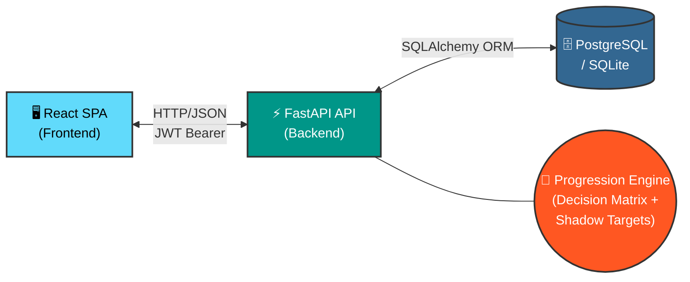
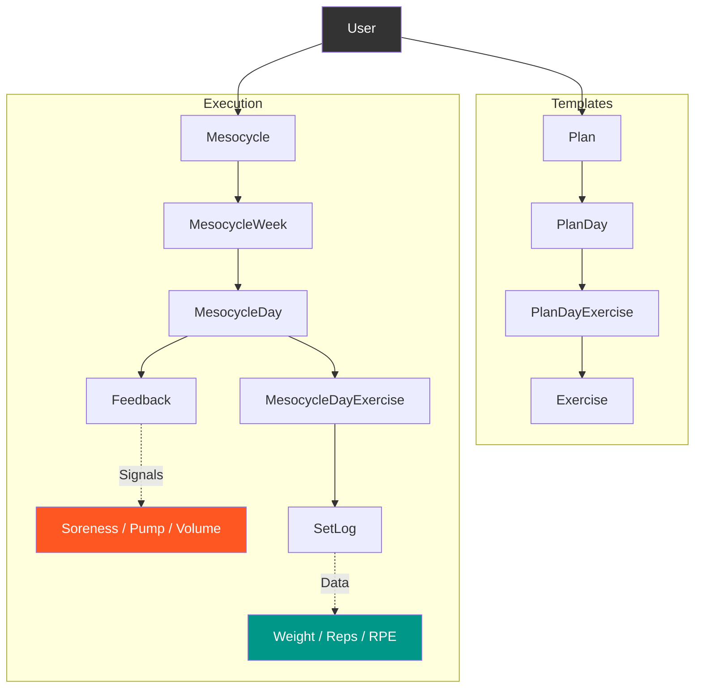
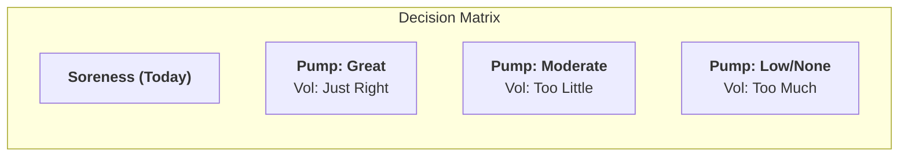

# 🏋️ Iron Protocol — Adaptive Workout Progression Engine

> A workout tracker that doesn't just log — it **thinks**. Built with FastAPI, SQLAlchemy, and a custom progression algorithm that cross-references soreness, pump quality, and volume perception to generate per-set targets in real time.


---

## 🧠 What Makes This Different

Most workout apps are glorified spreadsheets. You log sets, you look at numbers, you guess what to do next week.

**Iron Protocol eliminates the guessing.**

After every session, you submit three signals — **soreness**, **pump quality**, and **volume feeling**. The engine cross-references today's soreness against last session's pump and volume data, then runs a decision matrix to determine the **exact progression type** for each muscle group:

| Today's Soreness | Last Pump | Last Volume | → Action |
| :--- | :--- | :--- | :--- |
| **None / Light** | Great | Just Right | **+2.5kg weight** |
| **None / Light** | Low / None | Too Little | **+1 set** |
| **Moderate** | Great | Just Right | **+2 reps** |
| **Moderate** | Any | Too Much | **Maintain** |
| **Severe** | Low | Too Much | **Deload −15%** |
| **Severe** | Any | Too Little | **Deload −10%** |

The result: **per-set shadow targets** — exact weight and rep prescriptions for every set of every exercise, dynamically adjusted week over week.

---

## 🏗️ Architecture



### Data Model Hierarchy


---

## ✨ Features

### Core Workout System
- **Plan Builder** — Create reusable training templates (PPL, Upper/Lower, Full Body, etc.)
- **Mesocycle Execution** — Start a mesocycle from any plan, auto-generates weekly structure
- **Week Advancement** — Progress through weeks with automatic day/exercise scaffolding
- **Per-Set Logging** — Log weight, reps, and RPE for every set

### 🧠 Adaptive Progression Engine
- **3-Signal Feedback System** — Soreness (today) × Pump (last session) × Volume Feeling (last session)
- **Decision Matrix** — 9-cell matrix determines progression type per muscle group
- **Per-Set Shadow Targets** — Exact weight/rep prescriptions generated for every set
- **6 Progression Types** — `add_weight`, `add_reps`, `add_set`, `maintain`, `deload`, `add_set+reps`
- **Set Performance Evaluation** — Compare actual vs. target volume with `improved` / `hit` / `decreased` verdicts
- **Deload Intelligence** — Auto-prescribes 10-15% weight reductions with 2.5kg rounding

### Infrastructure
- **JWT Authentication** — Access + refresh token rotation with bcrypt hashing
- **RESTful API** — Full OpenAPI/Swagger documentation at `/docs`
- **Database Migrations** — Alembic for schema versioning
- **Containerized** — Docker Compose for one-command deployment
- **CI/CD** — GitHub Actions pipeline (lint + test)
- **Test Coverage** — 85%+ with pytest

---

## 🛠️ Tech Stack

| Layer | Technology |
|---|---|
| **Backend** | FastAPI, Pydantic v2, SQLAlchemy 2.0, Alembic |
| **Database** | PostgreSQL (production) / SQLite (development) |
| **Auth** | JWT (python-jose), bcrypt, OAuth2 Bearer |
| **Frontend** | React 18, React Router, Axios |
| **Testing** | pytest, pytest-cov, httpx (async test client) |
| **DevOps** | Docker, Docker Compose, GitHub Actions |

---

## 🚀 Quick Start

### Prerequisites
- Python 3.11+
- PostgreSQL 15+ (or use SQLite for development)
- Node.js 18+ (for frontend)

### Option 1: Docker (Recommended)

```bash
git clone https://github.com/Homayounp/iron-protocol.git
cd iron-protocol
docker-compose up --build
```
> **Backend:** http://localhost:8000 | **Frontend:** http://localhost:3000 | **Docs:** http://localhost:8000/docs

### Option 2: Manual Setup

```bash
# Backend
cd backend
python -m venv venv
source venv/bin/activate  # Windows: venv\Scripts\activate
pip install -r requirements.txt
alembic upgrade head
uvicorn app.main:app --reload
```
```bash
# Frontend (new terminal)
cd frontend
npm install
npm start
```
---

## 📡 API Reference

### Authentication

| Method | Endpoint | Description | Auth |
|---|---|---|---|
| `POST` | `/auth/register` | Create account | ❌ |
| `POST` | `/auth/login` | Get JWT tokens | ❌ |
| `POST` | `/auth/refresh` | Refresh access token | 🔄 |

### Exercises

| Method | Endpoint | Description | Auth |
|---|---|---|---|
| `POST` | `/exercises/` | Create exercise | ✅ |
| `GET` | `/exercises/` | List all exercises | ✅ |

### Plans (Templates)

| Method | Endpoint | Description | Auth |
|---|---|---|---|
| `POST` | `/plans/` | Create training plan | ✅ |
| `GET` | `/plans/` | List user plans | ✅ |
| `GET` | `/plans/{id}` | Get plan details | ✅ |
| `DELETE` | `/plans/{id}` | Delete plan | ✅ |

### Mesocycles (Execution)

| Method | Endpoint | Description | Auth |
|---|---|---|---|
| `POST` | `/mesocycles/` | Start mesocycle from plan | ✅ |
| `GET` | `/mesocycles/` | List mesocycles | ✅ |
| `GET` | `/mesocycles/{id}` | Get mesocycle detail | ✅ |
| `POST` | `/mesocycles/{id}/advance-week` | Advance to next week | ✅ |

### Workout Logging

| Method | Endpoint | Description | Auth |
|---|---|---|---|
| `POST` | `/mesocycles/days/{day_id}/sets` | Log a set | ✅ |
| `POST` | `/mesocycles/days/{day_id}/feedback` | Submit feedback | ✅ |
| `POST` | `/mesocycles/days/{day_id}/complete` | Mark day complete | ✅ |

### 🧠 Progression Engine

| Method | Endpoint | Description | Auth |
|---|---|---|---|
| `GET` | `/mesocycles/days/{day_id}/smart-targets` | Get per-set shadow targets | ✅ |
| `GET` | `/mesocycles/days/{day_id}/progression` | Get basic progression recommendations | ✅ |
| `POST` | `/mesocycles/{id}/apply-progression` | Apply feedback to next week | ✅ |

---

## 🔬 How the Progression Engine Works

### Phase 1: Signal Collection

Every completed session collects three subjective signals per muscle group:


```python
Soreness: "none" | "light" | "moderate" | "severe"
Pump:     "none" | "light" | "moderate" | "great"
Volume:   "too_little" | "just_right" | "too_much"
```

### Phase 2: Cross-Session Analysis

When you open Week N, the engine pulls:

- **Today's soreness** → from pre-workout feedback on current day
- **Last session's pump + volume** → from previous week's completed feedback

### Phase 3: Decision Matrix

These signals are fed into a deterministic decision matrix:



| Soreness (Today) | Pump: Great / Vol: Just Right | Pump: Moderate / Vol: Too Little | Pump: Low/None / Vol: Too Much |
|---|---|---|---|
| **None / Light** | ✅ +Weight (2.5kg) | ➕ +Set | ⏸️ Maintain |
| **Moderate** | 🔁 +Reps (+2) | 🔁 +Reps (+1) | ⏸️ Maintain |
| **Severe** | ⏸️ Maintain | 📉 Deload (−10%) | 📉 Deload (−15%) |

### Phase 4: Per-Set Target Generation

The engine generates exact targets for every set:

```json
{
  "exercise_name": "Barbell Row",
  "progression_type": "add_weight",
  "reason": "Great pump + good volume + fresh → +2.5kg",
  "set_targets": [
{"set_number": 1, "target_weight": 72.5, "target_reps": 10},
{"set_number": 2, "target_weight": 72.5, "target_reps": 9},
{"set_number": 3, "target_weight": 72.5, "target_reps": 8}
  ]
}
```
### Phase 5: Performance Evaluation

After logging, each set is evaluated:

- 📈 **Improved** → actual volume > target volume (+2%)
- ✅ **Hit** → within 5% of target
- 📉 **Decreased** → below 95% of target

---

## 🧪 Testing

```bash
cd backend

# Run all tests with coverage
pytest --cov=app --cov-report=html -v

# Run progression engine tests specifically
pytest tests/test_progression_engine.py -v
```
---

## 📁 Project Structure


iron-protocol/
├── app/
│   ├── __init__.py
│   ├── main.py              # FastAPI app + all route definitions
│   ├── models.py            # SQLAlchemy models (14 tables)
│   ├── schemas.py           # Pydantic request/response schemas
│   ├── crud.py              # All business logic + progression engine
│   ├── database.py          # DB connection + session management
│   └── utils.py             # JWT helpers, password hashing
├── tests/
│   ├── __init__.py
│   ├── test_progression_engine.py
│   └── conftest.py
├── alembic/
│   └── versions/
├── frontend/                # React SPA
│   ├── src/
│   └── package.json
├── docker-compose.yml
├── Dockerfile
├── requirements.txt
├── alembic.ini
└── README.md

---

## 🔮 Roadmap

- [x] JWT authentication with refresh tokens
- [x] Plan builder with day/exercise structure
- [x] Mesocycle execution with week advancement
- [x] Per-set logging (weight, reps, RPE)
- [x] 3-signal feedback system (soreness, pump, volume)
- [x] Adaptive progression engine with decision matrix
- [x] Per-set shadow targets
- [x] Set performance evaluation
- [ ] Exercise library with muscle group categorization
- [ ] Mesocycle analytics dashboard (volume trends, progression history)
- [ ] Workout templates marketplace
- [ ] Mobile-responsive PWA
- [ ] Data export (CSV / PDF)
- [ ] Rate limiting and request throttling

---

## 👤 Author

**Homayoun Pourattar**

- GitHub: [@Homayounp](https://github.com/Homayounp)
- Email: H.pourattar@gmail.com
