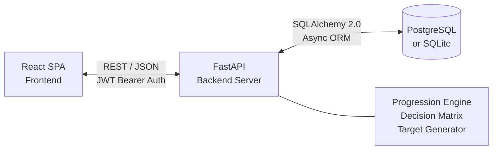
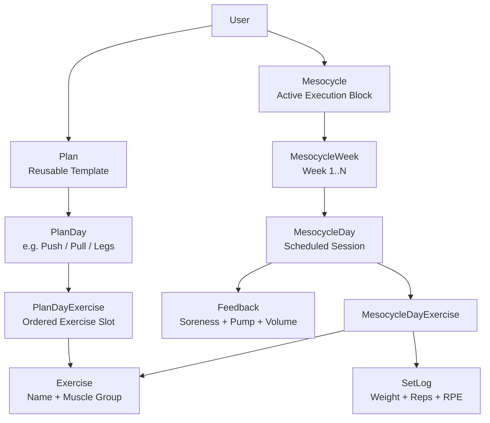

# Iron Protocol — Adaptive Workout Progression Engine

> A full-stack training management system featuring a custom progression algorithm that cross-references three physiological feedback signals (soreness, pump quality, volume perception) to generate individualized per-set training targets using a deterministic decision matrix.


---

## Motivation & Problem Statement

Existing fitness applications function primarily as logging tools — they record what a user has done but provide no systematic guidance on what to do next. Progression decisions are left entirely to the user, introducing subjectivity and inconsistency.

**Iron Protocol** addresses this gap by implementing a **closed-loop feedback system**: subjective session data is collected, cross-referenced across sessions, and processed through a rule-based decision matrix to produce concrete, per-set training prescriptions. The system models a simplified version of **autoregulation** — a concept well-established in sports science literature — as a deterministic algorithm.

This project was designed and built independently as a personal engineering challenge, with no reliance on tutorials or starter templates.

---

## System Architecture


| Layer | Technology | Rationale |
|---|---|---|
| **Backend** | FastAPI, Pydantic v2, SQLAlchemy 2.0 | Async-first, type-safe, auto-generated OpenAPI spec |
| **Database** | PostgreSQL (prod) / SQLite (dev) | Relational integrity for hierarchical training data |
| **Auth** | JWT (python-jose), bcrypt, OAuth2 Bearer | Stateless authentication with token rotation |
| **Frontend** | React 18, React Router, Axios | Component-based SPA with protected routing |
| **Testing** | pytest, pytest-cov, httpx | 85%+ coverage including integration tests |
| **DevOps** | Docker Compose, Alembic, GitHub Actions | Reproducible environments, automated CI pipeline |

---

## Data Model

The schema captures the full lifecycle of a training program — from abstract templates to concrete, logged performance data with feedback.


**14 relational tables** with foreign key constraints, cascading deletes, and uniqueness guarantees managed through Alembic migrations.

---

## Core Algorithm: Adaptive Progression Engine

### Design Approach

The engine implements a **three-phase pipeline** inspired by autoregulation principles from exercise science:

**Phase 1 — Signal Collection**

Three subjective feedback signals are collected per muscle group after each session:

| Signal | Scale | Source |
|---|---|---|
| **Soreness** | `none`, `light`, `moderate`, `severe` | Pre-workout, current day |
| **Pump Quality** | `none`, `light`, `moderate`, `great` | Post-workout, previous session |
| **Volume Perception** | `too_little`, `just_right`, `too_much` | Post-workout, previous session |

**Phase 2 — Cross-Session Analysis**

The engine performs a temporal join: today's soreness is paired with the previous session's pump and volume data for the same muscle group. This cross-referencing captures recovery quality — a muscle that was well-stimulated (great pump, appropriate volume) but shows no soreness is ready for increased load.

**Phase 3 — Decision Matrix**

The combined signals are mapped through a deterministic decision matrix:

| Today's Soreness | Last Pump | Last Volume | Progression Decision |
|---|---|---|---|
| None / Light | Great | Just Right | **Increase weight** (+2.5 kg) |
| None / Light | Low / None | Too Little | **Add set** (+1) |
| None / Light | Any | Too Much | **Maintain** current load |
| Moderate | Great | Just Right | **Add reps** (+2) |
| Moderate | Moderate | Too Little | **Add reps** (+1) |
| Moderate | Any | Too Much | **Maintain** current load |
| Severe | Great | Just Right | **Maintain** current load |
| Severe | Any | Too Little | **Deload** (−10% weight) |
| Severe | Low / None | Too Much | **Deload** (−15% weight) |

> Six progression types: `add_weight`, `add_reps`, `add_set`, `add_set+reps`, `maintain`, `deload`

**Phase 4 — Per-Set Target Generation**

The engine generates concrete prescriptions for every set:

```json
{
  "exercise_name": "Barbell Row",
  "progression_type": "add_weight",
  "reason": "Great pump + appropriate volume + no soreness → +2.5kg",
  "set_targets": [
{"set_number": 1, "target_weight": 72.5, "target_reps": 10},
{"set_number": 2, "target_weight": 72.5, "target_reps": 9},
{"set_number": 3, "target_weight": 72.5, "target_reps": 8}
  ]
}
```
Deload calculations apply percentage reductions with **2.5 kg rounding** (standard gym plate increments).

**Phase 5 — Performance Evaluation**

After set completion, actual volume is compared against prescribed targets:

| Verdict | Condition |
|---|---|
| **Improved** | Actual volume exceeds target by > 2% |
| **Hit** | Within ± 5% of target |
| **Decreased** | Below 95% of target |

This evaluation feeds forward into subsequent weeks, creating a **closed feedback loop**.

---

## API Design

Full RESTful API with OpenAPI documentation auto-generated at `/docs`.

### Authentication
| Method | Endpoint | Description |
|---|---|---|
| `POST` | `/auth/register` | Account creation |
| `POST` | `/auth/login` | JWT token pair issuance |
| `POST` | `/auth/refresh` | Access token renewal |

### Resource Management
| Method | Endpoint | Description |
|---|---|---|
| `POST` | `/exercises/` | Create exercise definition |
| `GET` | `/exercises/` | List exercises |
| `POST` | `/plans/` | Create training plan template |
| `GET` | `/plans/` | List user plans |
| `GET` | `/plans/{id}` | Retrieve plan with full structure |
| `DELETE` | `/plans/{id}` | Delete plan (cascade) |

### Mesocycle Execution
| Method | Endpoint | Description |
|---|---|---|
| `POST` | `/mesocycles/` | Initialize mesocycle from plan |
| `GET` | `/mesocycles/{id}` | Retrieve mesocycle state |
| `POST` | `/mesocycles/{id}/advance-week` | Generate next week's structure |
| `POST` | `/mesocycles/days/{day_id}/sets` | Log individual set |
| `POST` | `/mesocycles/days/{day_id}/feedback` | Submit session feedback |
| `POST` | `/mesocycles/days/{day_id}/complete` | Mark session complete |

### Progression Engine
| Method | Endpoint | Description |
|---|---|---|
| `GET` | `/mesocycles/days/{day_id}/smart-targets` | Retrieve per-set shadow targets |
| `GET` | `/mesocycles/days/{day_id}/progression` | Get progression recommendations |
| `POST` | `/mesocycles/{id}/apply-progression` | Apply decisions to next week |

---

## Software Engineering Practices

| Practice | Implementation |
|---|---|
| **Type Safety** | Pydantic v2 schemas for all request/response validation |
| **Database Migrations** | Alembic version-controlled schema evolution |
| **Test Coverage** | 85%+ with pytest; unit + integration tests |
| **CI/CD** | GitHub Actions: lint → test → report on every push |
| **Containerization** | Docker Compose for reproducible multi-service deployment |
| **API Documentation** | Auto-generated OpenAPI 3.0 spec via FastAPI |
| **Authentication** | JWT access + refresh token rotation, bcrypt password hashing |
| **Code Organization** | Separation of concerns: models, schemas, CRUD/business logic, routes |

---

## Running the Project

### Docker (Recommended)

```bash
git clone https://github.com/Homayounp/iron-protocol.git
cd iron-protocol
docker-compose up --build
```
| Service | URL |
|---|---|
| API Server | `http://localhost:8000` |
| API Documentation | `http://localhost:8000/docs` |
| Frontend | `http://localhost:3000` |

### Manual Setup

```bash
# Backend
cd backend
python -m venv venv && source venv/bin/activate
pip install -r requirements.txt
alembic upgrade head
uvicorn app.main:app --reload

# Frontend (separate terminal)
cd frontend
npm install && npm start
```
### Testing

```bash
pytest --cov=app --cov-report=html -v
```
---


## Future Development

- [x] JWT authentication with token rotation
- [x] Plan builder with hierarchical day/exercise structure
- [x] Mesocycle execution with automated week advancement
- [x] Per-set logging (weight, reps, RPE)
- [x] Three-signal feedback system
- [x] Adaptive progression engine with decision matrix
- [x] Per-set shadow target generation
- [x] Set performance evaluation (closed-loop feedback)
- [ ] Exercise library with muscle group taxonomy
- [ ] Analytics dashboard (volume trends, progression history)
- [ ] Mesocycle comparison and periodization visualization
- [ ] Progressive Web App (mobile-responsive)
- [ ] Data export (CSV / PDF training reports)

---

## Author

**Homayoun Pourattar**
- GitHub: [@Homayounp](https://github.com/Homayounp)
- Email: H.pourattar@gmail.com


